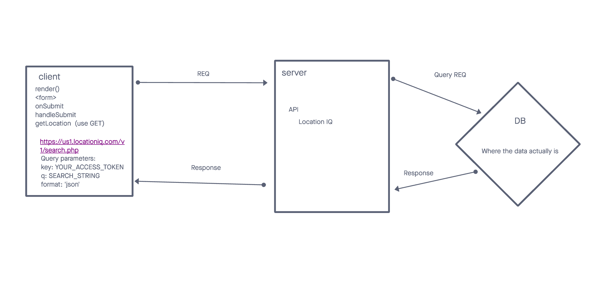
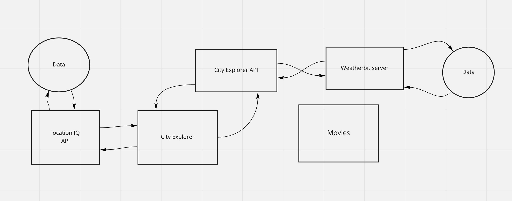
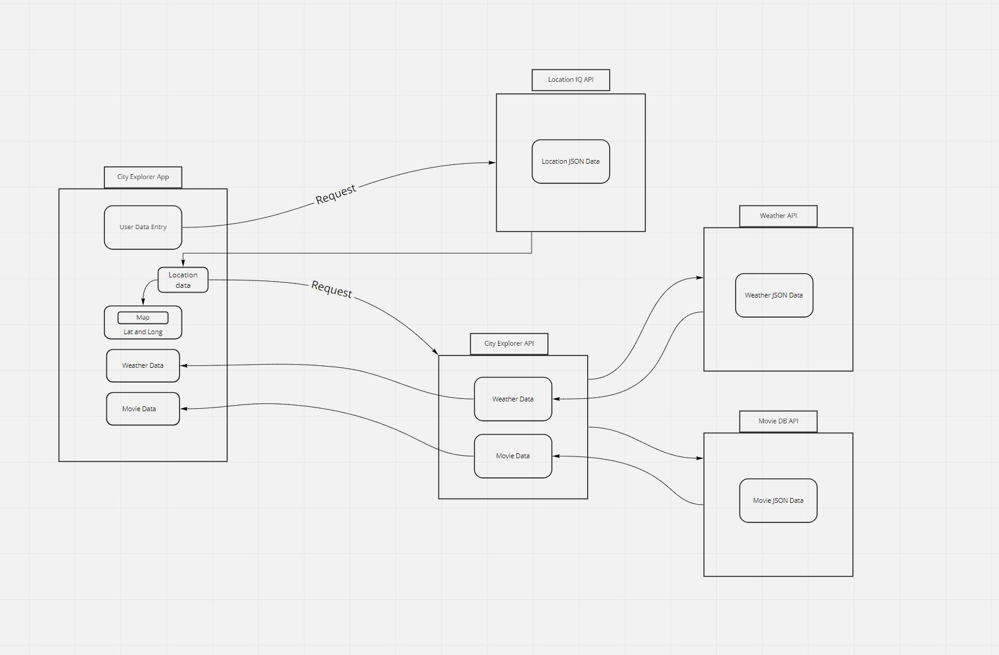

# City Explorer

**Author**: Spencer Tower
**Version**: 1.0.0 (increment the patch/fix version number if you make more commits past your first submission)

## Overview
This app allows users to submit a city name and recieve the latitude, longitue, and a map that displays the city location.

## Getting Started
<!-- What are the steps that a user must take in order to build this app on their own machine and get it running? -->

## Architecture
<!-- Provide a detailed description of the application design. What technologies (languages, libraries, etc) you're using, and any other relevant design information. -->
Technologies: Javascript, React, Bootstrap, HTML5, CSS3, LocationIQ

## Change Log
<!-- Use this area to document the iterative changes made to your application as each feature is successfully implemented. Use time stamps. Here's an example:

01-01-2001 4:59pm - Application now has a fully-functional express server, with a GET route for the location resource. -->

## Credit and Collaborations
<!-- Give credit (and a link) to other people or resources that helped you build this application. -->
Michael Metcalf
Jacob Choi
Kellen Linse

## Lab 06 

### Data Flow:

Name of feature: Locations

Estimate of time needed to complete: 1.5 hrs

Start time: 2:30

Finish time: _____

Actual time needed to complete: _____

## Lab 07 

### Data Flow:

Name of feature: city-explorer-api weather Query

Estimate of time needed to complete: 3 hrs

Start time: 3:00

Finish time: _____

Actual time needed to complete: 

## Lab 08

### Data Flow: Labs 08 & 09

Name of feature: 

Estimate of time needed to complete: 1.5 hrs

Start time: 2:30

Finish time: _____
